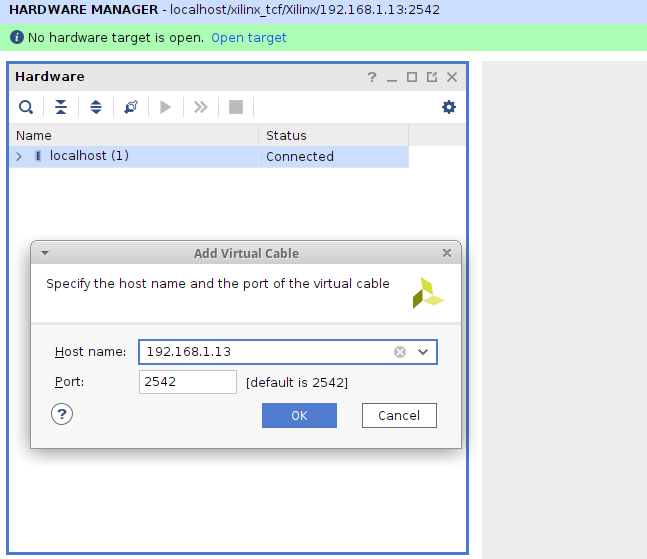

### Xilinx Virtual Cable Server for ESP8266

#### Overview

ESP8266 implementation of XVC (Xilinx Virtual Cable) protocol based on xvcd
(https://github.com/tmbinc/xvcd).

By connecting the ESP8266 to the JTAG pins (TDI, TDO, TMS, TCK) of the target
FPGA, you can access the JTAG port of the FPGA from a Xilinx tool (Vivado,
etc.) via WiFi.

Author: Gennaro Tortone (https://github.com/gtortone)

Author 2: Dhiru Kholia - Remove optimizations (in hope of gaining wider
compatibility), Mirror functions from `xvcpi` (to make debugging easier).

Note: This project was tested with Vivado 2021.1, WeMos D1 Mini as the JTAG
programmer (XVC daemon), and EBAZ4205 'Development' FPGA Board in August 2021.

#### How to use

Change the WiFi credentials in the `credentials.h` file.

Note: The default pin mappings for the common, low-cost `WeMos D1 Mini` ESP8266
development board are:

| ESP8266  | JTAG |
|----------|------|
| D6       | TDI |
| D4       | TDO |
| D7       | TCK |
| D5       | TMS |

Feel free to experiment with different ESP8266 development boards - most should
just work with any problems.


Next, build the program using Arduino IDE and write it to the ESP8266 board.

Finally, select the `Add Xilinx Virtual Cable (XVC)` option in the `Hardware
Manager` in Vivado and mention the `IP address` of the ESP8266 board.



#### How to use (Linux version)

```
make install_arduino_cli
make install_platform
make deps
make upload
```

### Tips

If you see the `End of startup status: LOW` error message in Vivado, check the
FPGA power supply's voltage and current ratings.

### Rough Performance Stats ("Speed")

If cost and ease-of-availability are the driving constraints (at the cost of
speed), then this project is 'usable' and can probably suffice. If higher
programming speed is a requirement, I recommend using `xc3sprog` or
`openFPGALoader` with an FT2232H board.

This project might be the cheapest `Vivado-Compatible` JTAG programmer.

https://github.com/gtortone/esp-xvcd is much faster but there have been reports
of `FPGA programming failures` with it.

https://github.com/pftbest/xvc-esp8266 - this has GPIO optimizations + a nice
program structure - thanks!

Also see the following `Related Projects` section.

### Related Ideas / Projects

- https://github.com/kholia/xvc-pico
- https://github.com/kholia/xvcpi
- https://github.com/kholia/xvc-esp32
- https://github.com/kholia/Colorlight-5A-75B
- https://github.com/fusesoc/blinky#ebaz4205-development-board

## License

Probably -> CC0 1.0 Universal (CC0 1.0) - Public Domain Dedication

https://creativecommons.org/publicdomain/zero/1.0/
